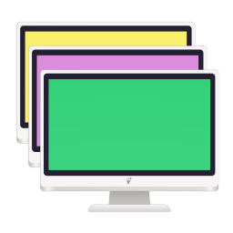
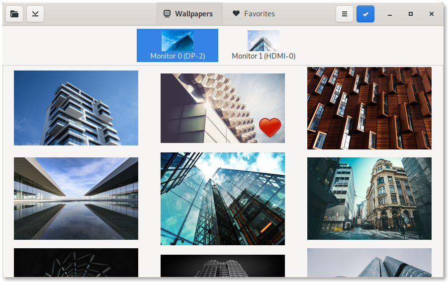
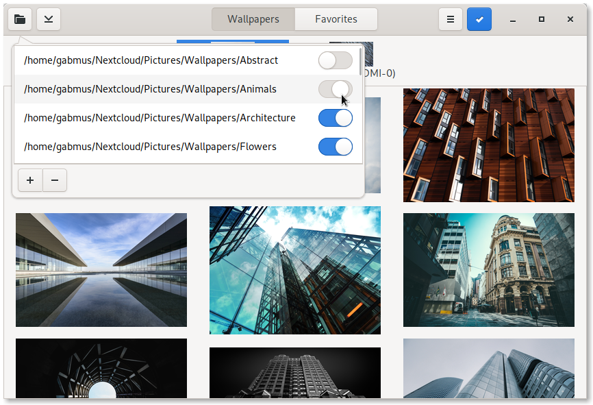
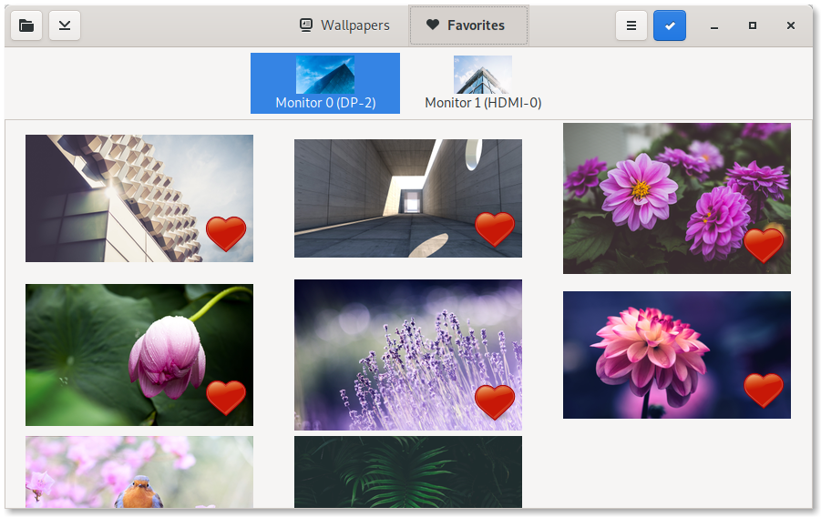
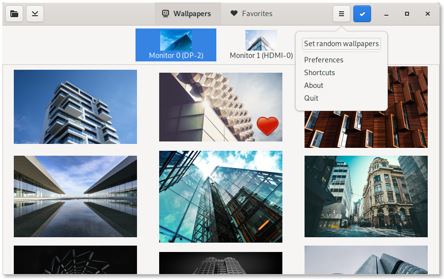
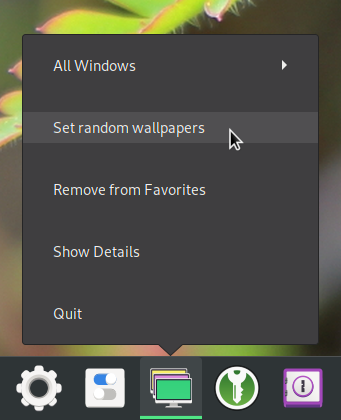
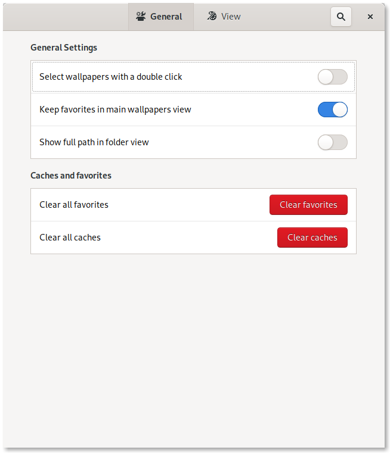
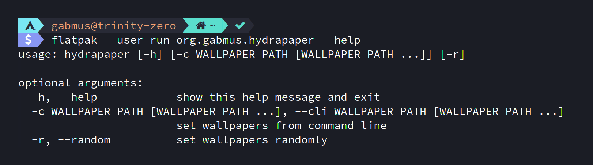

<nav>

- [ **HydraPaper**](#)
- [Features](#features)
- [Install](#install)
- [Hack](#hack)
- [Support](#support)

</nav>

<!--@MARGIN@-->

# HydraPaper

## Wallpaper manager with multimonitor support

---

## Features

### Add any folders to your collection

Manage your collection simply with folders, then add all of them to HydraPaper. You can enable or disable them with just a click.

### Pick your favorites

We all have favorite wallpapers for any mood. Add them as favorites, and quickly find them back in the *Favorites* section.

### Go random

You can quickly set random wallpapers, even from the app launcher. Fresh wallpapers in seconds.

### As you want it

Customize your interaction as you like it.

### CLI power

Set random of selected wallpapers from the command line. Great for custom scripts.

---

## Install

### Flatpak (recommended)

[Install **Flatpak** by following the quick setup guide](https://flatpak.org/setup/). Does it work on your distribution? Most likely.

Then, click the button below to install HydraPaper:

### Fedora

HydraPaper is available on Fedora's official repos. Just run `sudo dnf install hydrapaper` in your terminal to install it. Alternatively, use [Flatpak](#flatpak) to get the latest and greatest version of HydraPaper.

### AUR

If you're using Arch Linux or an Arch based system, you can install the [`hydrapaper-git`](https://aur.archlinux.org/packages/hydrapaper-git/) package from the AUR.

---

## Hack

HydraPaper is written using Python 3 and GTK+ 3. It's free software, released under the GPL3 license. Feel free to browse the source code on [the GitLab repository](https://gitlab.com/gabmus/hydrapaper), fork it, make changes or open issues!

---

## Support

Have you found a bug? Do you want a new feature? Whatever the case, opening an issue is never a bad idea. You can do that on [the issue page of HydraPaper's GitLab repository](https://gitlab.com/gabmus/hydrapaper)
